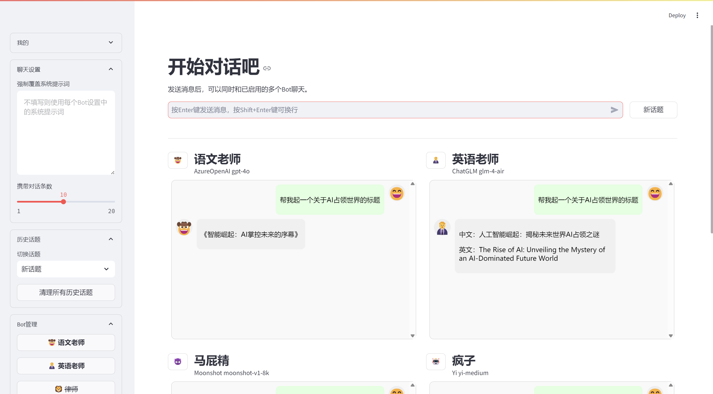
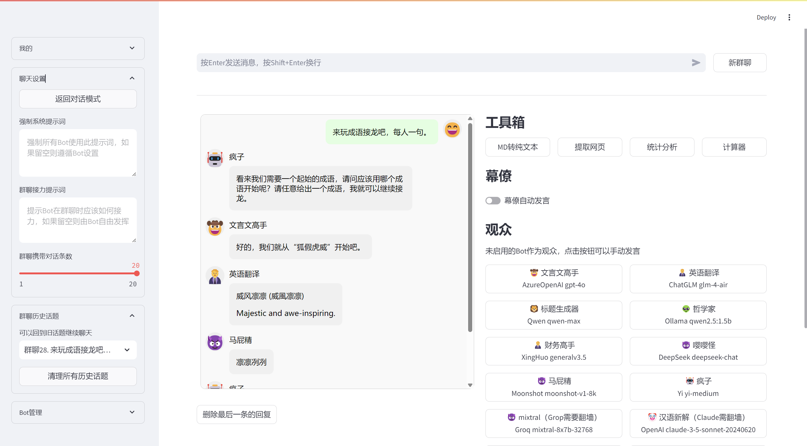
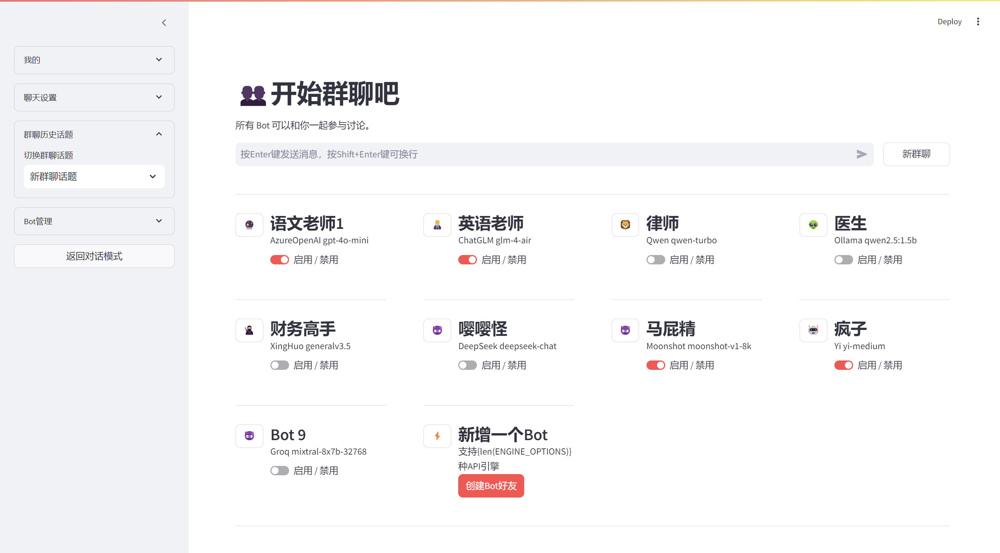

# MultiBot Chat

MultiBot Chat 是一个基于 Streamlit 的多机器人聊天应用，支持多种大语言模型（LLM）API，包括 AzureOpenAI、ChatGLM、CoZe、Qwen、Ollama、XingHuo、DeepSeek、Moonshot、Yi 和 Groq。这个应用允许用户同时与多个 AI 聊天机器人进行对话，比较不同模型的回答，并进行群聊式的讨论。

## 功能特点

- 支持多个 AI 聊天机器人同时对话
- 可以自定义每个机器人的系统提示（System Prompt）
- 支持多种大语言模型 API
- 用户注册和登录功能
- 聊天历史记录保存和查看
- 可调整的对话上下文长度
- 群聊模式：多个机器人接龙讨论

## 界面展示

### 对话模式

在主页面中，用户可以同时与多个 AI 机器人进行对话，直观地比较不同模型的回答。



对话模式允许用户同时与多个 AI 机器人进行交互。这种独特的设计不仅能让用户直观地比较不同模型的回答，还可以探索各种 AI 模型在相同问题上的表现差异。通过这种方式，用户可以更深入地了解不同 AI 模型的优势和特点，为选择最适合特定任务的模型提供宝贵的参考。

### 群聊模式

群聊模式下，多个 AI 机器人可以进行接龙式的讨论，例如玩成语接龙游戏。



群聊模式是 MultiBot Chat 的一大亮点，它不仅能让多个 AI 机器人进行有趣的互动，还可以模拟复杂的多方对话场景。用户可以观察不同模型如何协作完成任务，比较它们在群聊中的表现和互动方式，甚至可以自定义每个机器人的角色和专长，探索多样化的群聊动态。这种独特的功能为研究 AI 协作能力和测试不同模型在复杂对话环境中的表现提供了宝贵的平台。

### 集中管理机器人

MultiBot Chat 提供了方便的批量管理功能，让用户可以轻松控制多个机器人。



在群聊页面的侧边栏中，用户可以:

1. 编辑所有机器人
2. 调整聊天时携带的历史消息数量
3. 设置全局提示词，可覆盖每个机器人的设置
4. 设置群聊接力提示词，指导机器人如何在群聊中接力发言
5. 切换不同的话题，方便管理多个独立的讨论

这些功能大大提高了管理效率，使得用户可以轻松控制复杂的多机器人对话场景。


## 安装

1. 克隆仓库：
``` bash
git clone https://gitee.com/gptzm/multibot-chat.git
cd multibot-chat
```

2. 创建并激活虚拟环境（可选但推荐）：
``` bash
conda create -n multibot-chat python=3.11
conda activate multibot-chat
```

3. 安装依赖：
``` bash
pip install -r requirements.txt
```

## 配置

1. 在项目根目录创建 `.streamlit/secrets.toml` 文件，并添加必要的 API 密钥和其他敏感信息。

2. 根据需要修改 `bot/config.py` 文件中的模型配置。

## 运行

在项目根目录下运行以下命令：
``` bash
streamlit run app.py
```

或者，您可以使用提供的脚本：

- 在 Windows 上：双击 `multibot.bat`
- 在 Linux/Mac 上：运行 `./multibot.sh`

## 使用方法

1. 注册新用户或登录现有账户
2. 在侧边栏中添加新的聊天机器人
3. 选择要启用的机器人
4. 在聊天输入框中输入消息，与多个机器人同时对话
5. 使用侧边栏中的选项管理聊天设置和历史记录

## 许可证

MultiBot Chat 是自由软件,您可以根据自由软件基金会发布的GNU通用公共许可证的条款重新分发或修改它，您可以使用许可证的第3版,或(您可以选择)任何更新的版本。
发布 MultiBot Chat 是希望它能够有用,但没有任何担保;甚至没有对适销性或特定用途的适用性的暗示担保。详情请参阅GNU通用公共许可证。
您应该已经收到了一份GNU通用公共许可证的副本;如果没有,请参阅 <https://www.gnu.org/licenses/>。
