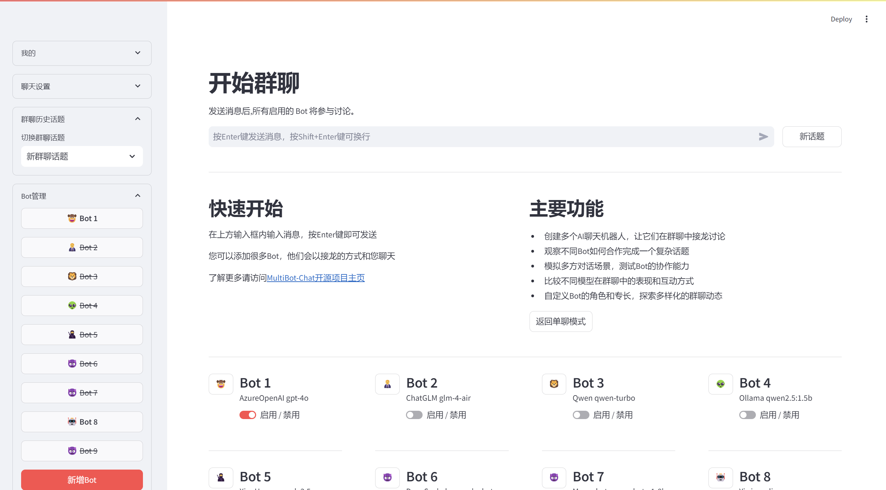
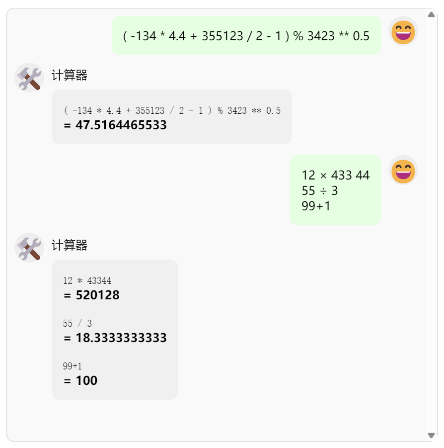

# MultiBot Chat

MultiBot Chat 是一个基于 Streamlit 的多机器人聊天应用，支持多种大语言模型（LLM）API，包括 OpenAI、AzureOpenAI、ChatGLM、CoZe、Qwen（通义千问）、Ollama、XingHuo（讯飞星火）、Qianfan（百度千帆文心一言）、DeepSeek（深度求索）、MiniMax（海螺）、Moonshot（月之暗面KIMI）、Stepfun（阶跃星辰）、Yi（零一） 、Groq、siliconflow（硅基流动）和 302AI代理。这个应用允许用户同时与多个 AI 聊天机器人进行对话，比较不同模型的回答，并进行群聊式的讨论。

## 主要特点

- 多机器人同时对话：与多个AI助手实时交互，直观比较不同模型的表现
- 群聊模式：让多个AI参与讨论，模拟复杂的多方对话场景
- 可扩展工具箱：通过自定义工具实现复杂工作流，提升AI协作能力
- 跨平台模型管理：批量操作和控制来自不同厂商的多种AI模型
- 云端同步设置：轻松在多设备间同步您的个性化配置

其他特色功能：
- 自定义系统提示词
- 支持多种主流大语言模型API
- 用户账户系统确保数据安全
- 灵活的对话历史管理
- 可调节的上下文长度

## 界面展示

### 对话模式

在主页面中，用户可以同时与多个 AI 机器人进行对话，直观地比较不同模型的回答。


对话模式允许用户同时与多个 AI 机器人进行交互。这种独特的设计不仅能让用户直观地比较不同模型的回答，还可以探索各种 AI 模型在相同问题上的表现差异。通过这种方式，用户可以更深入地了解不同 AI 模型的优势和特点，为选择最适合特定任务的模型提供宝贵的参考。

### 群聊模式

群聊模式下，多个 AI 机器人可以进行接龙式的讨论，例如玩成语接龙游戏。


群聊模式是 MultiBot Chat 的一大亮点，它不仅能让多个 AI 机器人进行有趣的互动，还可以主动让机器人发言或使用工具，实现复杂的工作流，模拟多方对话场景。用户可以观察不同模型如何协作完成任务，比较它们在群聊中的表现和互动方式，甚至可以自定义每个机器人的角色和专长，探索多样化的群聊动态。这种独特的功能为研究 AI 协作能力和测试不同模型在复杂对话环境中的表现提供了宝贵的平台。

### 集中管理机器人

MultiBot Chat 提供了方便的批量管理功能，让用户可以轻松控制多个机器人。



在群聊页面的侧边栏中，用户可以:

1. 编辑所有机器人
2. 调整聊天时携带的历史消息数量
3. 设置全局提示词，可覆盖每个机器人的设置
4. 设置群聊接力提示词，指导机器人如何在群聊中接力发言
5. 切换不同的话题，方便管理多个独立的讨论

这些功能大大提高了管理效率，使得用户可以轻松控制复杂的多机器人对话场景。

## 群聊工具箱

群聊过程中可以使用工具参与讨论，以实现复杂的工作流，目前自带的示例工具为：

1. **计算器**：可以提取上一条消息中的所有算式，返回每个算式的计算结果。
   

2. **统计分析**：可以计算上一条消息的行数字数，并对数字行进行求和、求均值、求中位数等统计操作。
   

3. **提取网页**：可以自动提取网页中的标题和正文部分，最多可以返回3个页面。
   

4. **一键讨论**：由AI来自动规划接下来1~3轮需要由哪些角色参与发言。**注意，一键讨论默认使用本地Ollama的qwen2.5:3b模型，如不具备本地条件，请在环境变量`MULTIBOT_BASE_LLM_MODEL`、`MULTIBOT_BASE_LLM_BASE_URL`、`MULTIBOT_BASE_LLM_API_KEY`中设置可引用的模型，目前支持所有兼容OpenAI接口的模型，推荐使用Qwen替代。**
   

5. **AI搜索**：提取消息中的链接，用AI重新组织语言后返回最多3条搜索结果，包括标题、链接和摘要。**注意，AI搜索依赖DuckDuckGo接口，使用时需要魔法。**
   

6. **MD转纯文本**：将Markdown格式的内容转换为纯文本，方便用户获取干净的文本信息。

通过以上步骤，您可以轻松扩展 MultiBot Chat 的功能满足您的特定需求，若需要添加新的工具，请阅读下文`自定义工具扩展`部分。

## 自定义工具扩展

您可以根据需要自行扩展工具，只需遵循以下步骤：

1. 在 `tools/` 目录下创建一个插件目录，程序启动时会自动加载。

2. 在插件目录中创建一个新的 Python 文件，例如 `my_tool.py`。在该文件中，您可以定义自己的功能。例如，您可以创建一个工具来处理文本分析或数据处理。

   示例代码：
   ```python
   # parameter = "本工具配置信息中的 parameter 参数"
   # content = "上一条消息的内容"
   # group_prompt = "群聊提示词"
   # group_history = "群聊历史记录"
   def run(parameter, content, group_prompt, group_history):
      
      # 您的自定义工具代码
      pass
      
      return "您的自定义工具输出"
   ```

3. 在 `tools/` 目录下创建一个 `config.json` 文件，用于存储工具的配置信息。您可以在此文件中定义工具的名称、描述和其他相关设置。

   示例 `config.json` 文件内容：
   ```json
   {
      "name": "工具名称",
      "description": "简要说明本工具的用途",
      "main_file": "入口文件名.py",
      "parameter": {
         "工具内部使用的参数": "可由工具开发者自行定义"
      },
   }
   ```

4. 在群聊页面中，您可以在聊天窗口的右侧工具箱中看到添加的工具，点击即可用这个工具参与讨论。

## 安装

1. 克隆仓库：
``` bash
git clone https://gitee.com/gptzm/multibot-chat.git
cd multibot-chat
```

2. 创建并激活虚拟环境（可选但推荐）：
``` bash
conda create -n multibot-chat python=3.11
conda activate multibot-chat
```

3. 安装依赖：
``` bash
pip install -r requirements.txt
# 如果下载慢，可以使用清华源：
# pip install -r requirements.txt -i https://pypi.tuna.tsinghua.edu.cn/simple
```

## 配置

1. 在项目根目录创建 `.streamlit/secrets.toml` 文件，并添加必要的 API 密钥和其他敏感信息。

2. 根据需要修改 `bot/config.py` 文件中的模型配置。

## 运行

在项目根目录下运行以下命令：
``` bash
streamlit run app.py
```

或者，您可以使用提供的脚本：

- 在 Windows 上：双击 `start_server.bat`
- 在 Linux/Mac 上：运行 `./start_server.sh`

## 环境变量

在使用 MultiBot Chat 之前，您可以设置一些环境变量来配置应用程序的行为。以下是一些关键的环境变量及其用途：
以下是 MultiBot Chat 的主要环境变量及其用途：

| 变量名 | 用途 | 默认值 |
|--------|------|------|
| `MULTIBOT_TOKEN_EXPIRATION` | 设置 token 的过期时间（以秒为单位） | "86400" |
| `MULTIBOT_SECRET_KEY_FILE` | 指定加密和解密 token 的密钥文件路径 | "secret.key" |
| `MULTIBOT_ENABLED_REGISTER` | 是否允许注册 | "true" |
| `MULTIBOT_SHOW_SECRET_INFO` | 控制是否在前端显示密钥信息，设置为 'true' 显示密钥信息，其他值或不设置则不显示 | "false" |
| `MULTIBOT_LOG_LEVEL` | 设置日志记录的级别，可选值有 'DEBUG', 'INFO', 'WARNING', 'ERROR', 'CRITICAL'，默认为 'INFO' | "INFO" |
| `MULTIBOT_USER_CONFIG_BASEDIR` | 指定用户配置文件的基础目录，每个用户一个加密文件 | "./user_config" |
| `MULTIBOT_USER_DATA_FILE` | 指定用户数据文件的路径 | "users.json" |
| `MULTIBOT_GUEST_USERNAMES` | 访客用户的账号，多个账号用,号连接 | "guest" |
| `MULTIBOT_DEVELOPER_USERNAME` | 开发者调试的账号 | "" |
| `MULTIBOT_BASE_LLM_MODEL` | 工具中所用的模型名称 | "qwen2.5:3b" |
| `MULTIBOT_BASE_LLM_BASE_URL` | 工具中所用的模型地址 | "http://127.0.0.1:11434/v1" |
| `MULTIBOT_BASE_LLM_API_KEY` | 工具中所用的模型API-KEY | "ollama" |

您可以将这些环境变量添加到您的 shell 配置文件（如 `.bashrc` 或 `.zshrc`）中，以便在每次启动 shell 时自动加载这些变量。

## 许可证

MultiBot Chat 是自由软件,您可以根据自由软件基金会发布的GNU通用公共许可证的条款重新分发或修改它，您可以使用许可证的第3版,或(您可以选择)任何更新的版本。
发布 MultiBot Chat 是希望它能够有用,但没有任何担保;甚至没有对适销性或特定用途的适用性的暗示担保。详情请参阅GNU通用公共许可证。
您应该已经收到了一份GNU通用公共许可证的副本;如果没有,请参阅 <https://www.gnu.org/licenses/>。
